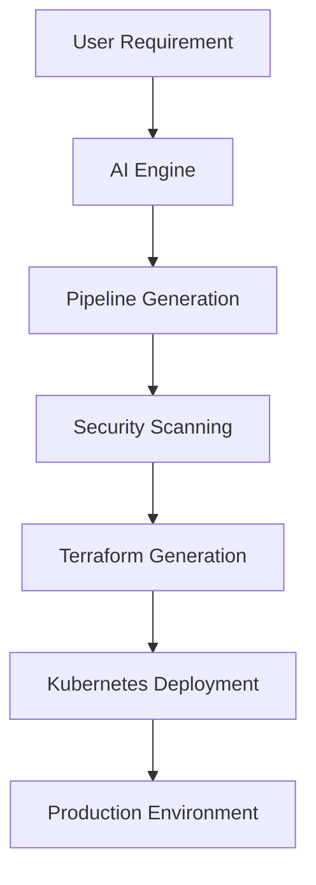

# 👋 Hi, I'm Bhargava Pasupuleti

<div align="center">

# 🚀 Senior DevSecOps Engineer | Cloud Architect | Platform Engineer

### Building Intelligent Cloud Platforms Through DevSecOps, Kubernetes & AI Automation


</div>

---

## 🌟 About Me

Experienced **Senior DevSecOps Engineer** with **8+ years** of expertise in:

- ☁️ Multi-Cloud Architecture (Azure, AWS, GCP)
- 🚀 CI/CD Automation
- 🔐 DevSecOps Implementation
- ☸️ Kubernetes Platform Engineering
- 🏗️ Infrastructure as Code (Terraform)
- 🐳 Containerization & Microservices
- 📊 Monitoring & Observability
- 🤖 AI-Powered DevOps Automation

Currently building **Pipeline AI**, an AI-powered platform that transforms natural language requirements into production-ready CI/CD pipelines.

---

# 🧠 Professional Summary

```yaml
Name: Bhargava Pasupuleti
Role: Senior DevSecOps Engineer
Experience: 8+ Years
Location: Andhra Pradesh, India

Specializations:
  - DevSecOps
  - Platform Engineering
  - Kubernetes
  - Terraform
  - Azure
  - AWS
  - GCP
  - CI/CD Automation
  - AI Automation

Current Focus:
  - AI Powered CI/CD Generation
  - Platform Engineering
  - Cloud Native Solutions
```

---

# ⚡ Technology Stack

## ☁️ Cloud Platforms


---

## 🚀 DevOps & CI/CD


---

## ☸️ Containers & Orchestration


---

## 🏗️ Infrastructure as Code


---

## 🔐 Security & Quality


---

## 📊 Monitoring & Observability


---

# 💼 Professional Experience

## 🏢 HTC Global Services

### Senior Engineer – Cloud & Infra Services

📅 June 2023 – Present

### Responsibilities

- GitLab Component-Based Pipeline Engineering
- Kubernetes Platform Management
- GCP Infrastructure Administration
- Snyk Security Integration
- DataDog Monitoring & Observability
- Enterprise DevSecOps Automation
- CI/CD Standardization

### Technologies

```text
GCP
GitLab
Kubernetes
Snyk
Kaniko
DataDog
Terraform
```

---

## 🏢 Persistent Systems

### DevOps Engineer

📅 September 2022 – June 2023

### Responsibilities

- Azure DevOps Implementation
- YAML Pipeline Migration
- Release Automation
- Build Engineering
- SonarQube Integration
- Veracode Security Scanning

### Technologies

```text
Azure DevOps
Docker
Terraform
YAML Pipelines
SonarQube
Veracode
```

---

## 🏢 Pacter Edge

### Cloud Engineer

📅 June 2018 – September 2022

### Responsibilities

- Azure Cloud Migration
- Infrastructure Automation
- Disaster Recovery
- Azure Networking
- Backup & Recovery
- Cloud Optimization

### Technologies

```text
Azure
Jenkins
Docker
Terraform
Cloud Migration
```

---

# 🚀 Featured Project

# Pipeline AI

## AI-Powered CI/CD Pipeline Generator

Transform Natural Language into Production-Ready DevSecOps Pipelines

### Workflow



### Features

- AI Generated YAML Pipelines
- Terraform Automation
- Kubernetes Manifest Generation
- Security Automation
- Multi-Cloud Deployment
- GitOps Ready Architecture

---

# 📊 GitHub Analytics


---

# 🏆 Certifications

## Microsoft Azure

✅ AZ-900 Azure Fundamentals

✅ AZ-104 Azure Administrator

---

## Google Cloud

✅ Professional DevOps Engineer

---

## Atlassian

✅ Agile Project Management Professional

---

# 🎯 Current Learning

```yaml
Learning:
  - AI Powered DevOps
  - Platform Engineering
  - Agentic AI
  - Kubernetes Advanced Patterns
  - Cloud Security
  - AIOps
```

---

# 🌐 Connect With Me

## 💼 LinkedIn

https://www.linkedin.com/in/bhargava-pasupuleti-b1780a249/

## 🐙 GitHub

https://github.com/pasupuletibhargavaroyal-gif

## 📧 Email

pasupuletibhargavaroyal@gmail.com

## 📱 Mobile

+91-9441122306

---

# 💡 Personal Motto

> "Automate Everything. Secure by Design. Scale with Confidence."

---

<div align="center">

### ⭐ If you like my work, feel free to connect and collaborate!

🚀 DevSecOps | ☁️ Cloud | ☸️ Kubernetes | 🤖 AI Automation

</div>
